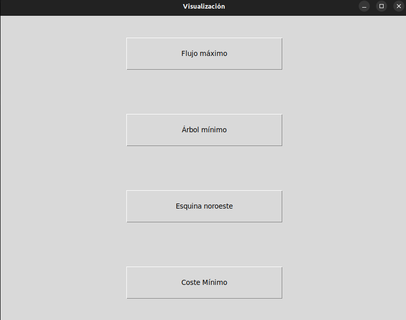
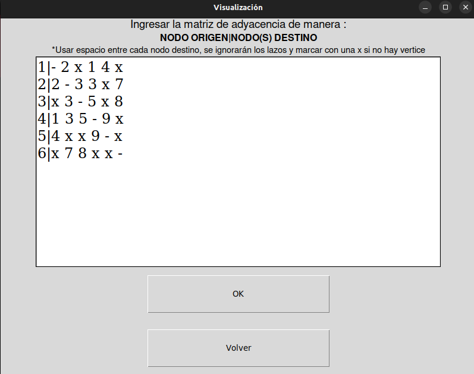
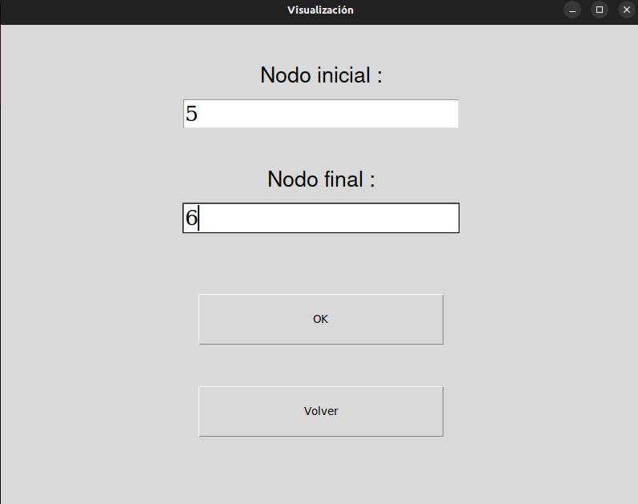
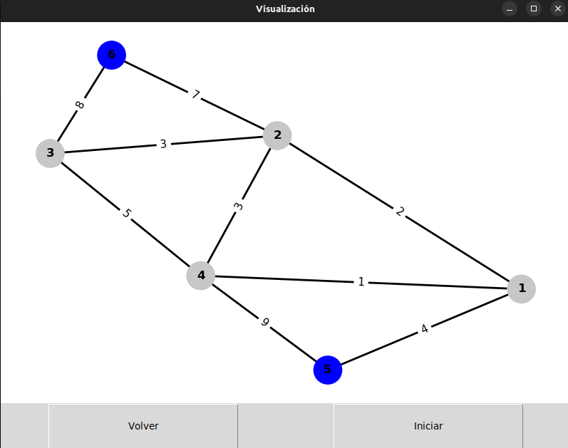
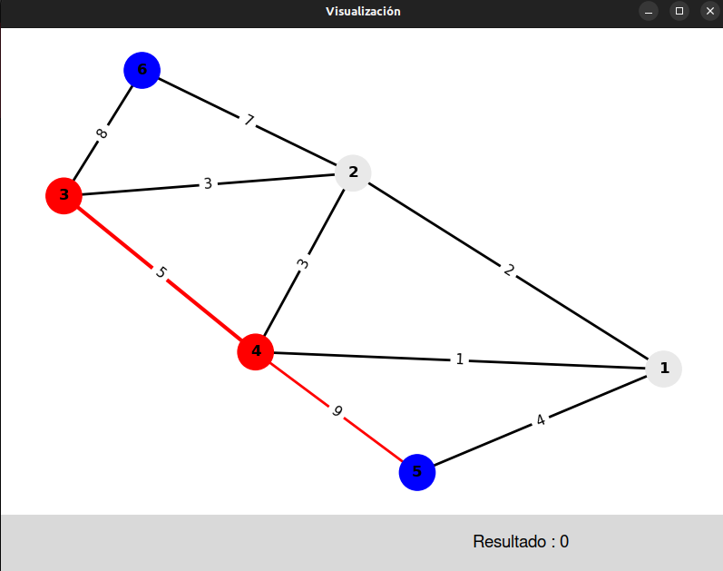
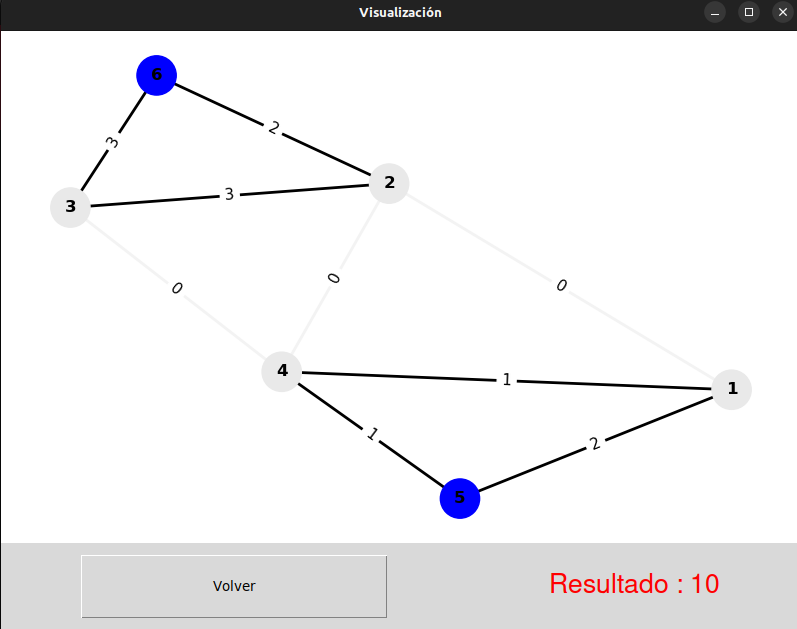
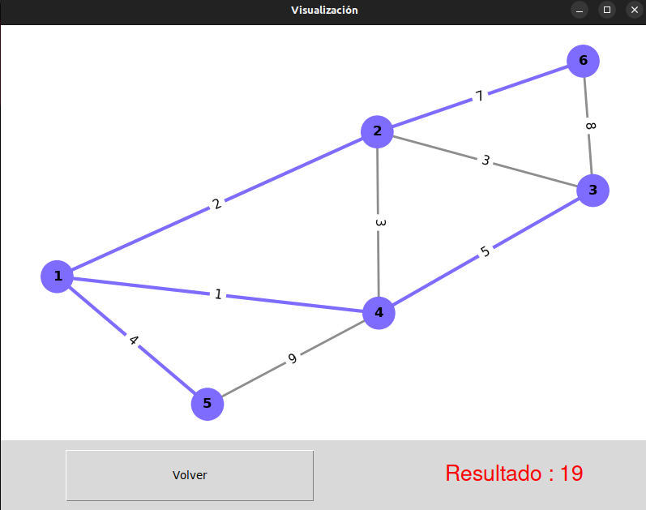
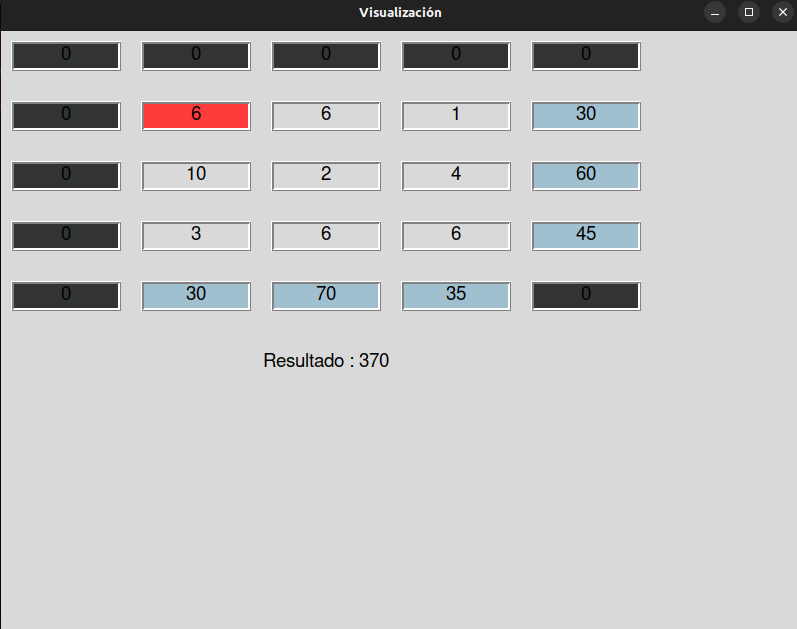
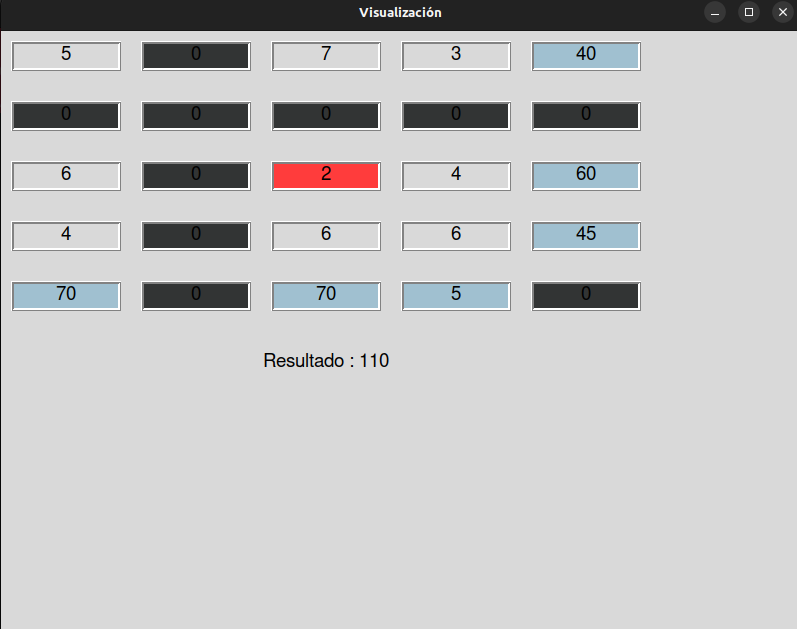

# Algorithm Visualizer

## Description

This program designed to help the visualization of the algorithms of minimum spanning tree, greedy max flow, northwest corner, and minimum cost for problems in distribution.It accepts input data and presents each algorithm's phases in an understandable manner. 

## Installation

For the usage of this program it's necesary having Python installed and the following packages :

- networkx
- matplotlib

You can install these packages by running the following command:

pip install networkx matplotlib

## Usage

To run the program, navigate to the directory where the file "main.py" is located and run the command :

- python3 main.py

The program will prompt you for input data in the form of a text box. Some examples are provided in the Examples folder. Once the input data is provided, the program 
will display the steps of each algorithm 

## Algorithms

- Minimum Spanning Tree: The program uses Prim's algorithm to find the minimum spanning tree of the input graph.
- Greedy Max Flow: The program uses the greedy algorithm to find the maximum flow of the input graph.
- Northwest Corner: The program uses the northwest corner method to find the solution of the transportation problem.
- Minimum Cost: The program uses the simplex method to find the minimum cost solution of the linear programming problem.

## Screenshots

## Contribution

We welcome contributions to this program. If you would like to contribute, please follow these guidelines:

- Fork the repository
- Create a new branch with a descriptive name
- Make your changes and commit them
- Open a pull request

## Issues

If you encounter any issues while using this program, please open an issue in the repository.

## Additional Resources

- [NetworkX documentation](https://networkx.github.io/documentation/stable/)
- [Matplotlib documentation](https://matplotlib.org/stable/contents.html)